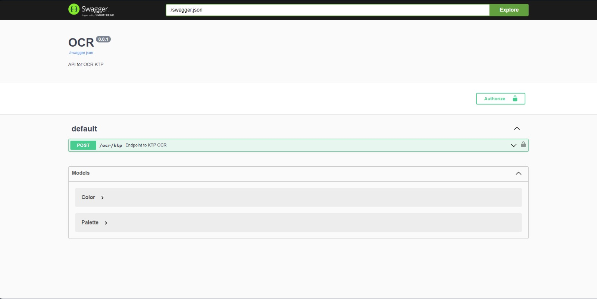

# OCR Indonesian Identity Card with Google Vision API

## Overview



This project is designed to perform Optical Character Recognition (OCR) on Indonesian Identity Cards using Google Vision API. The Google Vision API allows you to extract text information from images, making it suitable for processing images of identity cards and retrieving relevant details.

## Installation

1. Clone the repository:

    ```bash
    git clone https://github.com/yAJustiago/OCR-ID-CARd.git
    cd OCR-ID-CARD
    ```

2. Install dependencies:

    ```bash
    pip install -r requirements.txt
    ```

3. Set up Google Cloud Vision API:

    - Create a new project on [Google Cloud Console](https://console.cloud.google.com/).
    - Enable the Cloud Vision API for your project.
    - Create credentials (API key or service account key) and save it securely.

4. Install Poppler:
    
    Add Poppler [here](https://poppler.freedesktop.org/) in **poppler** folder.

5. Configure the project:

    Create a configuration file named `cloud_vision.json` and provide your Google Cloud Vision API credentials:

    ```json
        {
        "type": "",
        "project_id": "",
        "private_key_id": "",
        "private_key": "",
        "client_email": "",
        "client_id": "",
        "auth_uri": "",
        "token_uri": "",
        "auth_provider_x509_cert_url": "",
        "client_x509_cert_url": "",
        }
    ```

## How To Run

Run this [main.py](https://github.com/AJustiago/Face-Recognition/blob/main/main.py) file.
this repository consists of **API** using **Python Flask** at **0.0.0.0:6458/ocr/ktp**.

and for the swagger documentation at **0.0.0.0:6458/ocr/swagger**.

## Acknowledgments

1. **Google Vision API**: The OCR functionality in this project is powered by the Google Vision API. Visit [Google Cloud Vision API](https://cloud.google.com/vision) for more information.

2. **Poppler**: Image preprocessing in this project is facilitated by Poppler, a PDF rendering library. Learn more about Poppler [here](https://poppler.freedesktop.org/).
